# Aplicație de rezervare bilet la Teatru

## Descriere
Această aplicație web este o platformă pentru gestionarea spectacolelor de teatru, care permite utilizatorilor să vizualizeze spectacole, să cumpere bilete și să gestioneze rezervările.

## Tehnologii Utilizate
- Frontend: React.js, Material-UI, Redux Toolkit
- Backend: Node.js, Express.js, MongoDB
- Alte tehnologii: Axios, React Router, QR Code generator

## Ghid de Instalare

### Cerințe Preliminare
1. Instalați Node.js (https://nodejs.org/)
2. Instalați MongoDB Community Server (https://www.mongodb.com/try/download/community)
3. (Opțional) Instalați MongoDB Compass pentru vizualizarea bazei de date

### Pași de Configurare

#### 1. Configurare Bază de Date
 **Import Bază de Date**
```bash
# Din directorul rădăcină al proiectului:
mongorestore --db proiectulMeu ./database-backup/proiectulMeu
```
Pentru buna rulare a acestei comenzi, este nevoie de instalat MongoDB Database Tools de la: https://www.mongodb.com/try/download/database-tools
Se dezarhiveaza pachetul se adauga calea folderului bin in variabila de mediu PATH.

#### 2. Configurare Backend
```bash
# 1. Navigați în directorul backend
cd backend

# 2. Instalați dependențele
npm install

# 3. Copiați .env.example în .env
cp .env.example .env

# 4. Porniți serverul
node app.js
```

#### 3. Configurare Frontend
```bash
# 1. Într-un terminal nou, navigați în directorul frontend
cd frontend

# 2. Instalați dependențele
npm install

# 3. Porniți aplicația
npm start
```

### Verificare Instalare
1. Backend-ul ar trebui să ruleze pe http://localhost:5000
2. Frontend-ul ar trebui să ruleze pe http://localhost:3000
3. În MongoDB Compass puteți verifica baza de date conectându-vă la: mongodb://localhost:27017

## Structura Bazei de Date
Baza de date conține următoarele colecții:
- **admins**: Conturi de administrator
- **users**: Utilizatori înregistrați
- **plays**: Spectacole de teatru -> nu mai sunt folosite in proiect 
- **bookings**: Rezervări
- **movies**: Spectacole de teatru

## Roluri:
•	Guest → poate vedea lista spectacolelor, dar nu poate face rezervări.
•	User (autentificat) → poate face rezervări.
•	Admin → gestionează spectacolelor și rezervările


## Conturi pentru Testare
1. **Cont Administrator**
   - Email: r@y.com
   - Parolă: robertel

2. **Cont Utilizator**
   - Email: a@y.com
   - Parolă: 122


## Funcționalități

### 1. Navbar (Header)
Bara de navigare modernă și responsive oferă acces rapid la toate funcționalitățile aplicației:

#### Design și Comportament
- Poziționare fixă în partea superioară a paginii (sticky header)
- Efect de transparență și blur la scroll
- Design responsiv pentru dispozitive mobile și desktop

#### Componente Principale
1. **Logo și Branding**

2. **Sistem de Căutare**
   - Căutare instantanee în toate spectacolele
   - Afișează primele 10 spectacole după rating când nu există termen de căutare
   - Caută în titlul spectacolului

3. **Meniu de Navigare**
   - **Pentru Vizitatori**:
     - Link către Spectacole
     - Buton de Autentificare
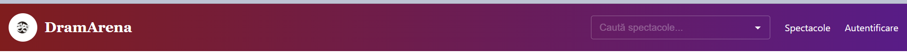
   - **Pentru Utilizatori Autentificați**:
     - Link către Profil
     - Buton de Deconectare
     - Buton de Notificari
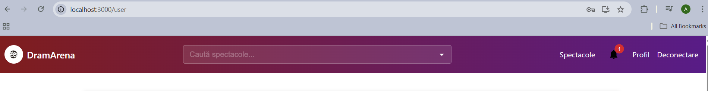
   - **Pentru Administratori**:
     - Link către Panoul Admin
     - Buton de Deconectare

4. **Versiune Mobilă**
   - Meniu hamburger pentru dispozitive mobile
   - Drawer lateral cu toate opțiunile
   - Căutare adaptată pentru ecrane mici
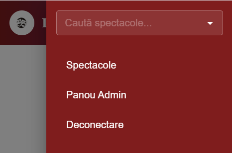

### 2. Pagina Principală (HomePage)
Pagina principală a aplicației oferă o experiență modernă și atractivă pentru vizitatori, cu următoarele elemente:

#### Hero Section
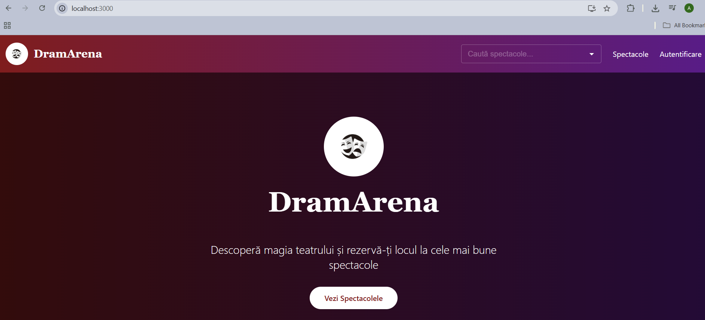
- Imagine de fundal cu gradient dinamic
- Logo-ul teatrului (DramArena)
- Titlu principal și slogan
- Butoane de acțiune pentru:
  - Vizualizarea spectacolelor
  - Accesarea panoului de administrare (pentru admini)
  

#### Carousel de Spectacole
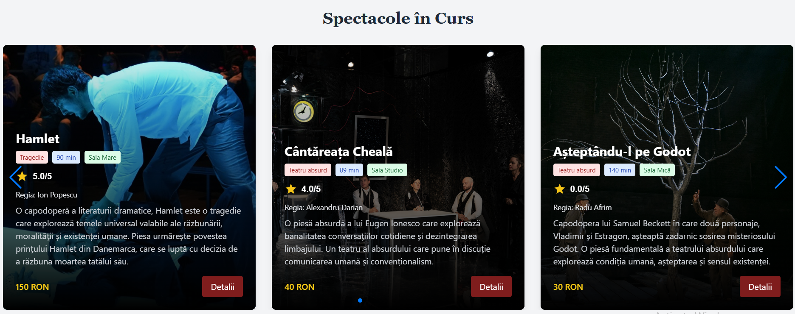
- Afișare automată a spectacolelor în curs
- Design responsive (1-3 spectacole pe rând, în funcție de dimensiunea ecranului)
- Pentru fiecare spectacol se afișează:
  - Imaginea posterului
  - Titlul spectacolului
  - Genul și durata
  - Sala de spectacol
  - Rating-ul spectacolului
  - Regizorul
  - Descriere scurtă
  - Prețul biletului
  - Buton pentru detalii

#### Secțiunea de Caracteristici
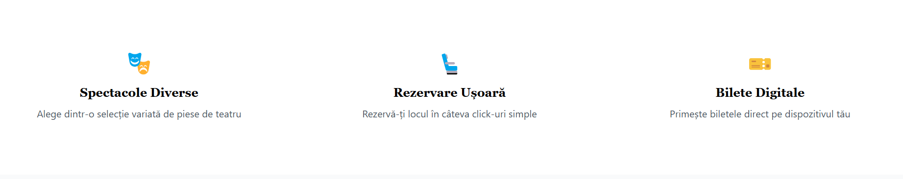
- Trei card-uri care evidențiază avantajele platformei:
  - Spectacole Diverse
  - Rezervare Ușoară
  - Bilete Digitale

#### Harta de Localizare
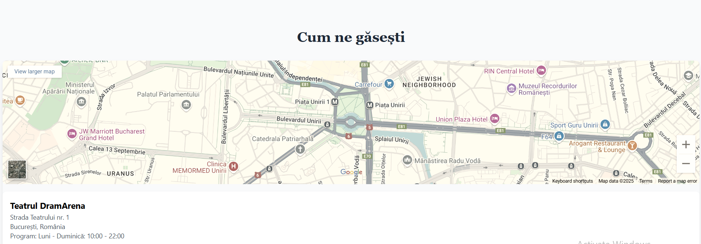
- Integrare cu Leaflet pentru afișarea locației teatrului
- Harta interactivă pentru ghidare

### 3. Pagina de Spectacole
- Paginare cu 9 spectacole per pagină
- Filtrare avansată:
  - După gen
  - După durată
  - După preț
  - După sală
- Sortare după:
  - Rating (implicit)
  - Preț (crescător/descrescător)
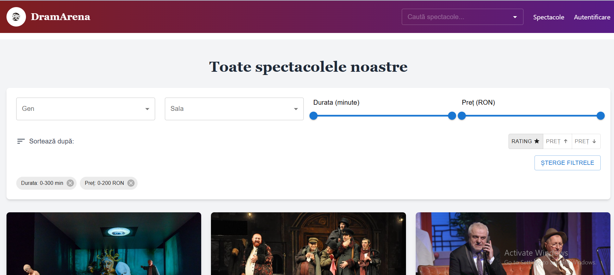

- Card-uri interactive pentru fiecare spectacol:
  - Poster
  - Titlu și detalii
  - Rating mediu
  - Preț
  - Buton de rezervare (pentru utilizatori autentificați)
  - Butoane de editare/ștergere (pentru administratori)
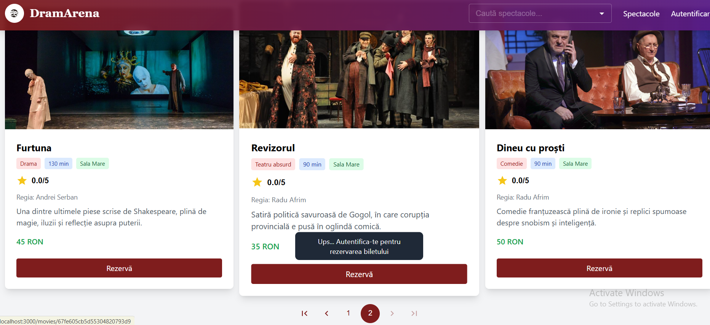

### 4. Pagina de Detalii Spectacol
Pagina detaliată a unui spectacol oferă funcționalități diferite în funcție de rolul utilizatorului:

#### Pentru Vizitatori (Guest)
- Vizualizare informații complete despre spectacol:
  - Poster mare
  - Titlu și gen
  - Descriere detaliată
  - Regizor și actori
  - Rating mediu și număr de evaluări
  - Preț bilet
  - Program reprezentații
- Buton de autentificare pentru rezervare

#### Pentru Utilizatori Autentificați
- Toate funcționalitățile vizitatorilor
- Sistem de rating:
  - Posibilitatea de a acorda o notă (1-5 stele)
  - Modificare rating anterior
- Rezervare bilete:
  - Selectare dată și oră
  - Vizualizare locuri disponibile
  - Buton de rezervare cu redirecționare către pagina de rezervare

#### Pentru Administratori
- Toate funcționalitățile utilizatorilor
- Funcții de administrare:
  - Editare informații spectacol
  - Adăugare/Modificare reprezentații
  - Ștergere spectacol
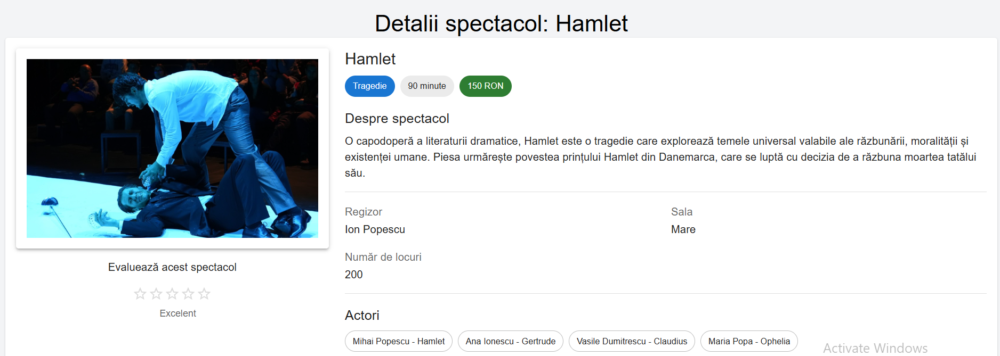

### 5. Panoul de Administrare
Panoul de administrare oferă o interfață modernă și intuitivă pentru gestionarea completă a platformei:

#### Dashboard Principal
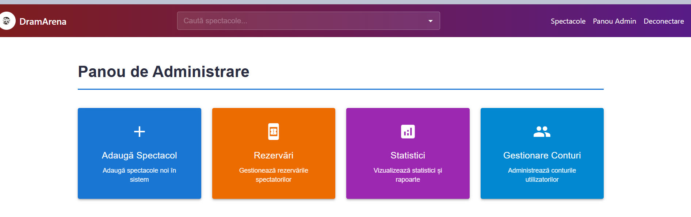
- Card-uri interactive pentru accesul rapid la funcționalități:
  - Adăugare Spectacole
  - Gestionare Rezervări
  - Statistici
  - Gestionare Conturi

#### Gestionare Spectacole
- Adăugare spectacole noi cu:
  - Informații complete (titlu, descriere, gen, etc.)
  - Încărcare poster
  - Programare reprezentații
- Editare spectacole existente
- Ștergere spectacole (cu notificări automate pentru utilizatorii afectați)
- Gestionare reprezentații:
  - Adăugare/ștergere date
  - Actualizare număr de locuri disponibile
  - Sistem automat de notificări pentru modificări

#### Gestionare Rezervări
- Vizualizare toate rezervările

#### Statistici și Rapoarte
- Grafice interactive pentru:
  - Vânzări pe perioade
  - Ocupare săli
  - Rating-uri spectacole
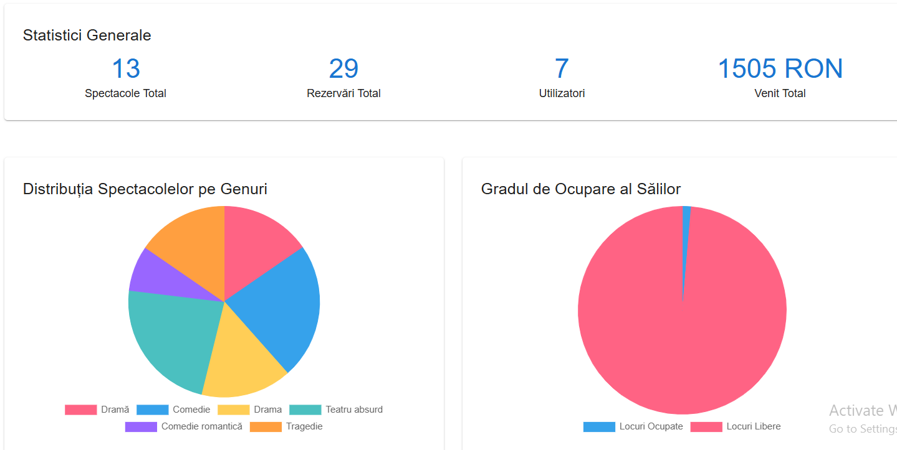

#### Gestionare Utilizatori
- Listă completă utilizatori
- Gestionare conturi

### 6. Pagini de Profil

#### Profil Utilizator
Pagina de profil pentru utilizatori obișnuiți oferă o interfață personalizată pentru gestionarea contului și vizualizarea activității:

##### Informații Cont
- Detalii personale
- Email și nume utilizator

##### Istoric Rezervări
- Lista completă a rezervărilor făcute
- Optiunea de a vizualiza si de a sterge biletul 
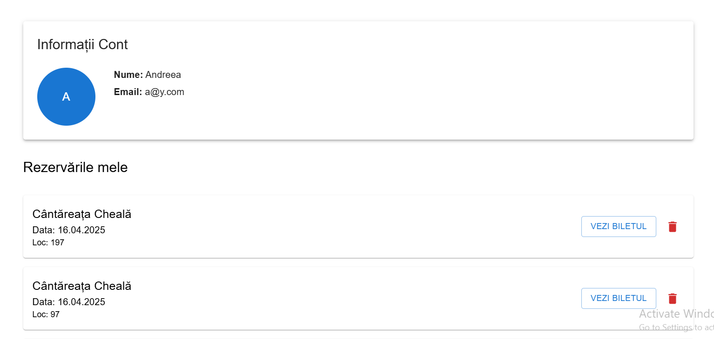


